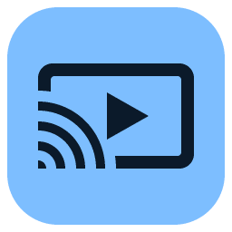
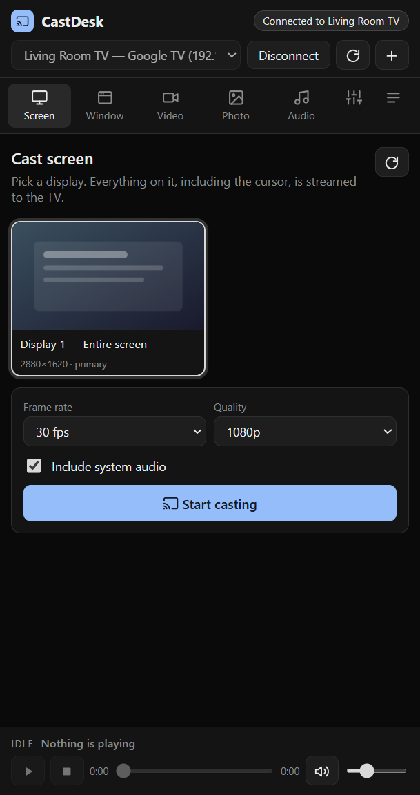
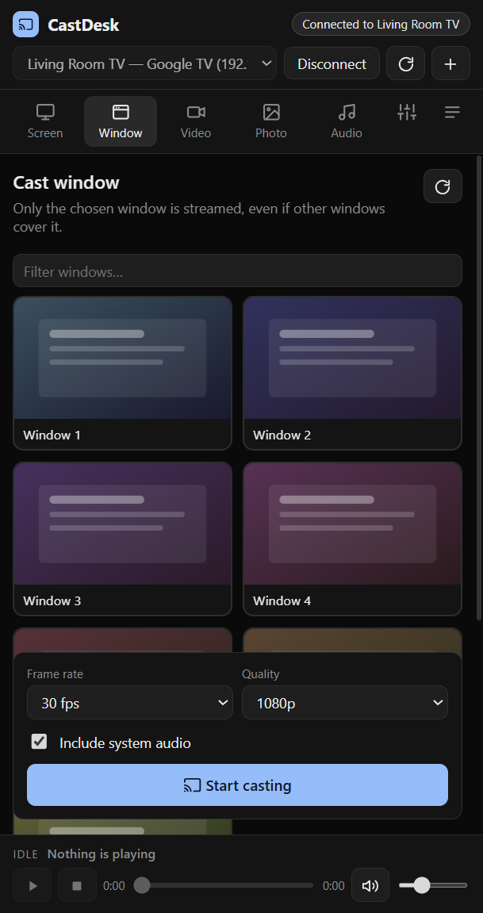
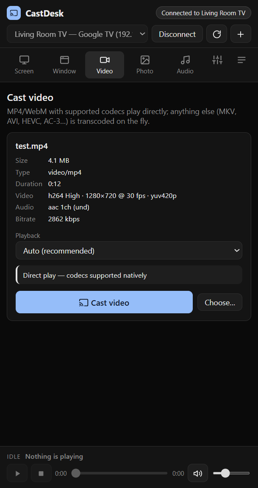

<h1 align="center">
  <br>
  CastDesk
</h1>

<p align="center">
  Cast your <b>screen</b>, a single <b>window</b>, <b>videos</b>, <b>photos</b> and <b>audio</b> from Windows to any Chromecast / Google TV.<br>
  <a href="https://github.com/falghamdi125/CastDesk/releases/latest"><b>⬇ Download the latest release</b></a>
</p>

<p align="center">
  
  
  
</p>

## Features

**Screen & window mirroring**
- **Chrome-style Cast mirroring**: CastDesk speaks Google's Cast Streaming protocol — the same one Chrome uses — sending encrypted VP8 over RTP/UDP straight to the TV with no player buffer, for sub-second latency. Lost packets are retransmitted and picture loss recovers automatically.
- Mirror an entire display, or just one window — even when other windows cover it (Windows Graphics Capture).
- Mirroring is video-only for now; untick *Chrome-style mirroring* to use the HTTP live stream instead, which carries **system audio** and keeps itself near the live edge by speeding the TV up until it catches up.
- HTTP path: H.264/AAC; Chromium's own encoder is remuxed untouched, or ffmpeg re-encodes with NVIDIA NVENC / Intel Quick Sync / AMD AMF / libx264 (auto-detected). If the TV declines a mirroring session, CastDesk falls back to this path automatically.
- Frame rate (15/30/60) and quality (720p / 1080p / 1440p / native) per session; an ffmpeg GDI capture engine is available as a fallback.

**Video**
- MP4/WebM with codecs the TV supports play **directly**, with full seeking.
- Anything else (MKV, AVI, HEVC, AC-3/DTS audio, 10-bit…) is **transcoded on the fly** — video is only re-encoded when needed, and you can still seek.
- Audio-track selection, codec/bitrate/duration inspection, direct/auto/transcode override.

**Photo** — JPEG, PNG, GIF, WebP and BMP shown full-screen on the TV.

**Audio**
- MP3, AAC/M4A, FLAC, WAV, OGG and Opus play natively; WMA, ALAC, AIFF, APE… are converted to AAC on the fly.
- Title, artist, album and embedded **cover art** are shown on the TV.
- **Stream your PC's audio**: whatever Windows is playing goes to the TV, with no video.

**Devices & playback**
- Automatic discovery of Cast devices (mDNS, works across multiple network adapters), plus add-by-IP.
- Auto-connects to the last used TV when it comes online.
- Play / pause / stop / seek / volume / mute for whatever is casting.
- Small portrait window, dark theme, drag-and-drop for every media type.

## Install

Grab either file from the [latest release](https://github.com/falghamdi125/CastDesk/releases/latest):

| File | What it is |
| --- | --- |
| `CastDesk-Setup-1.1.0.exe` | Installer (per-user, choose the folder, Start-menu shortcut) |
| `CastDesk-Portable-1.1.0.exe` | Portable — no installation, just run it |

Requires Windows 10 1903 or newer. ffmpeg is bundled; nothing else to install.

> **Windows Firewall:** the TV streams media *from your PC* over HTTP. When Windows asks on first launch, allow CastDesk on **private** networks — if the TV never starts playing, check that rule first.

## Usage

1. Pick your TV in the top bar (discovered automatically, or **+** to add an IP) and press **Connect**.
2. Choose a tab:
   - **Screen / Window** — select a source, set frame rate and quality, **Start casting**.
   - **Video / Photo / Audio** — drop a file or browse, then **Cast**.
   - **Audio → Stream this PC's audio** — cast system audio without video.
3. Control playback from the bar at the bottom; **Stop** ends a live session.

Expected glass-to-glass latency for mirroring is roughly 2–4 s — inherent to the Cast media protocol (Chrome's own tab casting uses a private WebRTC protocol that third-party apps can't use).

## Run from source

```powershell
npm install
npm start          # or: npm run dev   (opens DevTools)
npm test           # local end-to-end tests, no TV required
npm run dist       # build dist/CastDesk Setup 1.0.0.exe + dist/CastDesk 1.0.0.exe
```

Node.js 18+ is required. `ffmpeg-static` / `ffprobe-static` download a bundled ffmpeg during `npm install`.
If `npm start` fails with `Cannot read properties of undefined (reading 'whenReady')`, your shell has `ELECTRON_RUN_AS_NODE=1` set (typical for terminals spawned by VS Code extensions) — run `$env:ELECTRON_RUN_AS_NODE=$null` first.

## How mirroring works

1. The renderer captures the chosen screen/window with `getDisplayMedia`; Electron's `setDisplayMediaRequestHandler` picks the source and adds Windows audio loopback.
2. Frames are drawn onto a fixed-size canvas at the chosen frame rate — a steady cadence even when the screen is static, and an even-sized resolution.
3. `MediaRecorder` encodes (H.264/AAC in fragmented MP4 when Chromium supports it, otherwise H.264/VP8/VP9 in WebM) and streams 250 ms chunks to the main process.
4. The main process forwards the fMP4 as-is, or pipes it through ffmpeg (`-c:v copy` when the video is already H.264, otherwise a GPU or software encoder), into an fMP4 broadcaster.
5. The broadcaster hands the init segment plus keyframe-aligned fragments to any HTTP client; the Cast device is told to play `http://<pc>:<port>/live/<token>` as a `LIVE` stream.

Video and audio files use the same local server: direct play with HTTP range support, or an on-demand ffmpeg transcode per request (seeking restarts the transcode at the new offset).

## Testing without a TV

`npm test` runs [`test/e2e.js`](test/e2e.js), an Electron harness that exercises every pipeline locally and plays the result in a Chromium `<video>` element (the Cast receiver is Chromium-based, so it is a close stand-in): all capture/encode variants, the GDI engine, video and audio transcodes with seeking, direct play with ranges, image serving and the system-audio stream. Fixtures are generated with ffmpeg.

## Settings

- **Capture engine** — Chromium (default; system audio, robust window capture) or FFmpeg GDI (video only).
- **H.264 encoder** — auto (GPU preferred) / NVENC / Quick Sync / AMF / software; **passthrough** toggle; bitrate override.
- **Video files** — auto / always direct / always transcode; HEVC/AV1 direct play for Google TV & Chromecast Ultra.
- **Devices** — auto-connect to the last used TV.
- Stored in `%APPDATA%\castdesk\settings.json`.

## Project layout

```
src/main/main.js       Electron main: IPC, casting orchestration, display-media handler
src/main/discovery.js  mDNS discovery (one socket per network interface) + manual devices
src/main/caster.js     castv2-client wrapper (connect, launch receiver, load, transport controls)
src/main/server.js     local HTTP server: /media (ranges), /tx (ffmpeg transcode), /live (broadcast)
src/main/mp4.js        fMP4 box parser, keyframe detection, live broadcaster
src/main/ffmpeg.js     probing, direct-play planning, encoder detection, ffmpeg arg builders
src/main/live.js       live session manager (Chromium chunks or gdigrab → broadcaster)
src/main/settings.js   persisted settings
src/main/preload.js    contextBridge API for the renderer
src/renderer/          UI (vanilla HTML/CSS/JS, inline SVG icons)
test/e2e.js            local end-to-end pipeline tests
scripts/make-icon.js   generates assets/icon.png
```

## Limitations

- Subtitle tracks are not cast (yet).
- Mirroring latency of a few seconds is normal; not suitable for gaming.
- HDR / 10-bit content is always transcoded to 8-bit H.264.
- Cast Audio groups appear in the device list but only make sense for audio content.

## License

MIT
